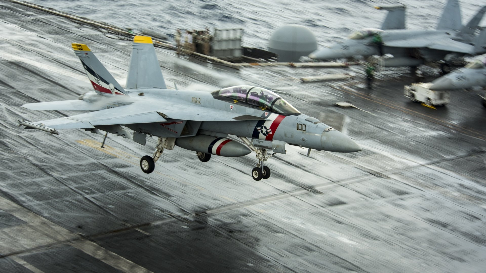

# programa TopGun

#### El objetivo del programa TopGun es que el piloto por medio de un menu de opciones va poder interactuar con su F18, las opciones son las siguientes:

1. #### Inicializar F18
   El sistema deberá preguntarle cuánto combustible tiene el avión a bordo, el apodo del piloto y su número de escuadrón.
2. #### Alternar estado de los flaps
   El estado de los flaps debe alternarse, es decir, si antes de pulsarlo, los flaps estaban Abajo, pasarán a estar Arriba. Si por el contrario,
   antes de pulsarlo, los flaps estaban Arriba, pasarán a estar Abajo.
3. #### Alternar estado del tren de aterrizaje
   El estado del tren de aterrizaje debe alternarse, es decir, si antes de pulsarlo, estaba Abajo, deberán pasar a estar Arriba. Si por el
   contrario, antes de pulsarlo, estaban Arriba, pasarán a estar abajo
4. #### Armar sistema de eyección
   El estado del sistema de eyección (Que si no lo sabes, es el que permite que el piloto salte en paracaídas cuando la cosa se pone fea)
   también debe alternarse como en los casos anteriores, es decir debe pasar de Desarmado a Armado y viceversa.
5. #### Eyectar piloto
   Si el estado del sistema de eyección es Armado, el piloto saltará en paracaídas, por lo tanto tendrá que cambiar el estado del asiento
   de ocupado a desocupado
6. #### Salir
   Sale del programa  hola

